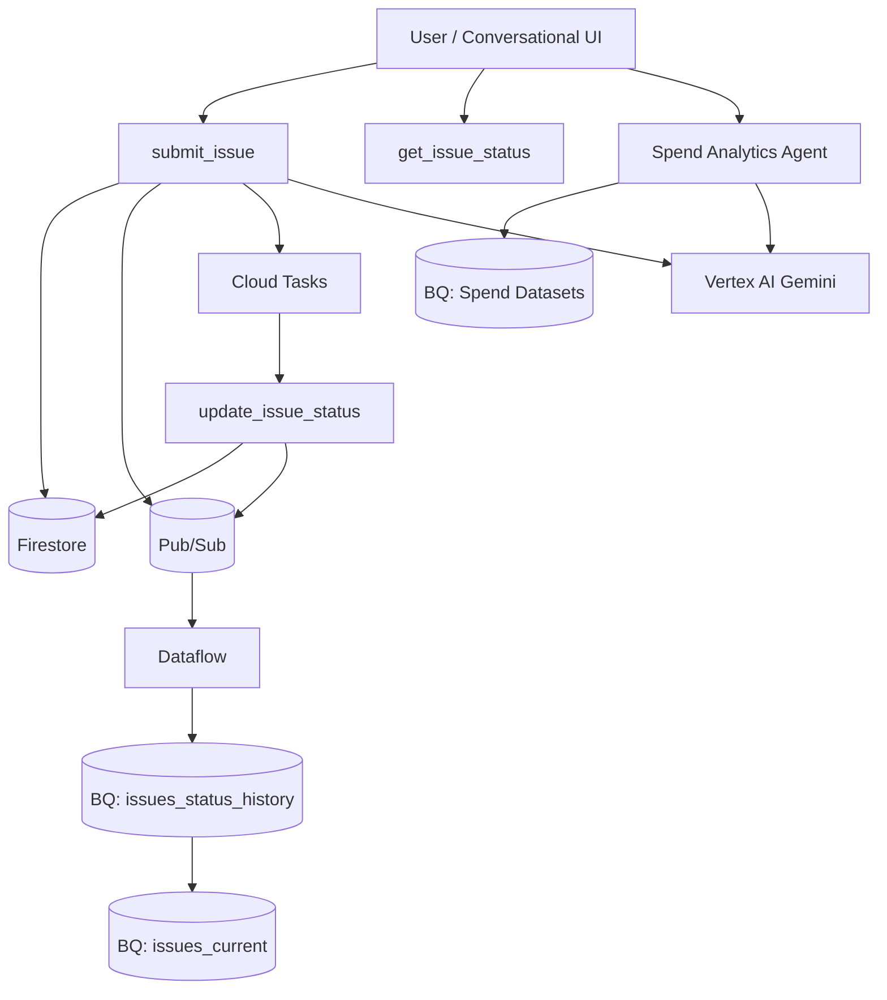

## Issue Management & Spend Analytics – Multi-Agent Platform (GCP)

---

## 1. Executive Summary

This document describes the end-to-end architecture of a **serverless, event-driven Issue Management and Spend Analytics platform** built on Google Cloud Platform.

The system supports:

* Automated issue lifecycle management
* Conversational AI–based user interaction
* Real-time operational queries
* Streaming analytics and SLA reporting
* A secure, controlled Spend Analytics Agent

The architecture follows **cloud-native, cost-optimized, and agent-safe design principles**, enabling scalability, auditability, and future expansion without refactoring.

---

## 2. Architectural Goals

| Goal                   | Description                               |
| ---------------------- | ----------------------------------------- |
| Scalability            | Handle growth without capacity planning   |
| Cost efficiency        | Pay only for usage; avoid expensive scans |
| Agent safety           | Prevent uncontrolled access to data       |
| Auditability           | Maintain immutable event history          |
| Low latency            | Instant responses for conversational UI   |
| Separation of concerns | Operational vs analytical workloads       |

---

## 3. High-Level Architecture Overview

The platform is composed of **two logical domains**:

1. **Issue Management Domain**
   Handles issue creation, lifecycle automation, and real-time status queries.

2. **Spend Analytics Domain**
   Provides controlled, read-only financial insights through a dedicated agent.

Both domains share **common infrastructure patterns** but remain logically isolated.

---

## 4. Core Architecture Principles

### 4.1 Event-Driven Design

* All state changes emit events
* Events are immutable and append-only
* Downstream systems consume events asynchronously

### 4.2 Dual Data Model

* **Operational State** → Firestore
* **Analytical History** → BigQuery

### 4.3 Agent-First APIs

* Agents interact only via safe, read-only APIs
* No direct database access from conversational UI

### 4.4 Serverless by Default

* Cloud Functions (Gen2)
* Pub/Sub
* Dataflow
* BigQuery
* Cloud Tasks

---

## 5. Issue Management Architecture (End-to-End)

---

### 5.1 User / Conversational UI

Users interact via:

* Chat UI
* Web / App UI
* Vertex AI Conversational Agent

Supported intents:

* “Create an issue”
* “What’s the status of my issue?”
* “Is my issue completed?”

---

### 5.2 API Layer – Cloud Functions (Gen 2)

#### 5.2.1 `submit_issue`

**Purpose**

* Creates a new issue
* Computes SLA
* Triggers automation
* Publishes initial lifecycle event

**Responsibilities**

* Validate request
* Persist issue in Firestore
* Publish `new` event to Pub/Sub
* Schedule lifecycle via Cloud Tasks
* Return Gemini acknowledgement

---

#### 5.2.2 `update_issue_status`

**Purpose**

* Handles lifecycle transitions

**Trigger**

* Cloud Tasks (time-based)

**Responsibilities**

* Read current state
* Update Firestore status
* Publish lifecycle event (`assigned`, `in_progress`, `completed`)

---

#### 5.2.3 `get_issue_status`

**Purpose**

* Read-only API for agents and UI

**Responsibilities**

* Fetch current issue state
* Return safe, structured response
* No side effects

---

### 5.3 Firestore – Operational Store

**Collection:** `issues`

**Role**

* Stores the **current state** of each issue
* Used for real-time reads and updates

**Characteristics**

* One document per issue
* Point reads by issue_id
* Low latency
* No analytical queries

---

### 5.4 Cloud Tasks – Lifecycle Automation

**Role**

* Executes delayed lifecycle transitions
* Ensures reliability and retries

**Why Cloud Tasks**

* Prevents long-running functions
* Avoids polling
* Ensures idempotent execution

---

### 5.5 Pub/Sub – Event Backbone

**Role**

* Decouples operational workflows from analytics
* Transports lifecycle events

**Event Schema**

```json
{
  "issue_id": "INC-123",
  "old_status": "assigned",
  "new_status": "in_progress",
  "priority": "P3",
  "source": "cloud_tasks",
  "changed_at": "2026-01-08T14:15:00Z"
}
```

---

### 5.6 Dataflow – Streaming Ingestion

**Type**

* Google-managed `PubSub_to_BigQuery` template

**Responsibilities**

* Consume Pub/Sub events
* Enforce schema
* Stream into BigQuery

**Design Choice**

* No transformations
* No custom Beam logic
* Schema enforced at producer

---

### 5.7 BigQuery – Issue Analytics Layer

#### 5.7.1 `issues_status_history`

**Type:** Immutable event log
**Written by:** Dataflow

**Purpose**

* Lifecycle trace
* SLA calculation
* Auditing
* Trend analysis

---

#### 5.7.2 `issues_current`

**Type:** Derived table
**Written by:** Scheduled MERGE

**Purpose**

* One row per issue
* Fast dashboard queries
* Agent analytics

---

### 5.8 Scheduled MERGE (State Materialization)

**Role**

* Derives latest issue state from history
* Runs every few minutes
* Eliminates repeated window queries

---

## 6. Spend Analytics Agent Architecture

---

### 6.1 Spend Data Sources

* Billing exports
* Application usage metrics
* Internal finance feeds

---

### 6.2 Spend Data Storage (BigQuery)

| Table                    | Purpose                  |
| ------------------------ | ------------------------ |
| `spend_raw`              | Immutable raw spend data |
| `spend_aggregated_daily` | Daily cost summaries     |
| `spend_current_month`    | Optimized agent queries  |

---

### 6.3 Spend Analytics Agent

**Responsibilities**

* Answer cost and usage questions
* Explain trends using Gemini
* Never generate SQL

**Example Queries**

* “What is my spend this month?”
* “Which service costs the most?”
* “Why did spend increase last week?”

---

### 6.4 Spend Agent Safety Rules

* No dynamic SQL
* Predefined queries only
* Read-only access
* Aggregated datasets only

---

## 7. Multi-Agent Interaction Model

| Agent           | Data Source                | Purpose          |
| --------------- | -------------------------- | ---------------- |
| Issue Agent     | Firestore / issues_current | Real-time status |
| Analytics Agent | BigQuery                   | Trends, SLA      |
| Spend Agent     | BigQuery                   | Cost insights    |

---

## 8. Cost Optimization Strategy

### Key Decisions

* Firestore for point reads (cheap, fast)
* BigQuery only for analytics
* Derived tables to avoid repeated scans
* Serverless everywhere (scale to zero)
* No LLM-generated SQL

### Cost-Saving Outcomes

* Predictable spend
* No runaway queries
* No idle infrastructure
* Controlled AI usage

---

## 9. GCP Logical Architecture Diagram



---

## 10. Security & Access Model (High-Level)

* Public access only for agent-safe APIs
* No direct database access from UI
* IAM-controlled service-to-service access
* Read-only BigQuery access for agents

---

## 11. Why This Architecture Is Production-Grade

* Event-sourced
* Horizontally scalable
* Cost-controlled
* Agent-safe
* Auditable
* Extensible

This design aligns with **modern enterprise cloud architecture standards**.

---

## 12. Future Enhancements

* SLA breach alerts
* Escalation workflows
* Cost anomaly detection
* Predictive resolution times
* Looker dashboards
* Fine-grained IAM policies

---

## 13. Final Summary

This architecture delivers a **robust, scalable, and intelligent platform** that combines:

* Automated Issue Management
* Conversational AI
* Streaming analytics
* Secure Spend Analysis

It is **ready for production**, **easy to extend**, and **safe for AI-driven interaction**.

---


